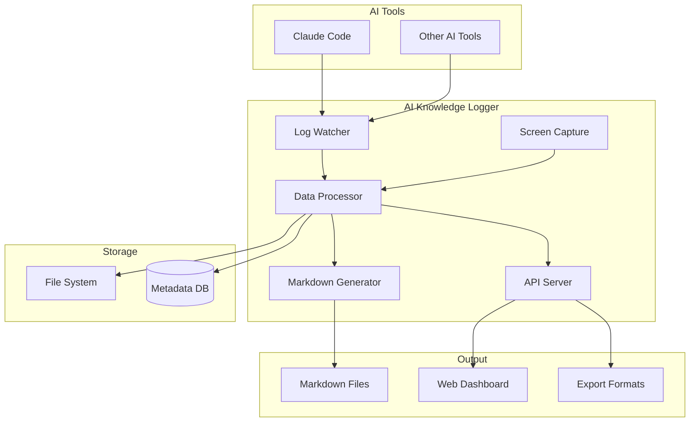

# AI Knowledge Logger - オープンソースプロジェクト設計書

## 🎯 プロジェクト概要

**AI Knowledge Logger (AIKL)** は、AIツール（特にClaude Code）との作業セッションを自動的に記録し、チームで共有可能な知識として蓄積するオープンソースツールです。

### 背景

本プロジェクトは、[Claude Codeセッション自動記録システムの構築](/2025-07-29-claude-session-logging-with-screenshots)の実装経験から生まれました。個人的な記録システムから、誰もが使える汎用ツールへと発展させることで、AI活用の知識共有を促進します。

### 解決する課題

1. **知識の喪失**: AIとの貴重な対話が記録されずに失われる
2. **共有の困難さ**: 効果的なAI活用方法がチーム内で共有されない
3. **手動記録の負担**: 対話を手動で記録することの非効率性
4. **コンテキストの欠如**: テキストログだけでは状況が伝わりにくい

## 🏗️ アーキテクチャ設計

### システム全体図



### コアコンポーネント

#### 1. **Log Watcher** (ログ監視)
```typescript
interface LogWatcher {
  // Claude Codeのログファイルを監視
  watchDirectory(path: string): void;
  
  // 新規ログエントリを検出
  onNewEntry(callback: (entry: LogEntry) => void): void;
  
  // セッション境界を判定
  detectSessionBoundary(): SessionInfo;
}
```

#### 2. **Screen Capture** (画面キャプチャ)
```typescript
interface ScreenCapture {
  // Snap-Happy統合
  captureScreen(): Promise<Screenshot>;
  
  // 自動キャプチャトリガー
  setupAutoCapture(rules: CaptureRule[]): void;
  
  // キャプチャ履歴管理
  getScreenshotHistory(): Screenshot[];
}
```

#### 3. **Data Processor** (データ処理)
```typescript
interface DataProcessor {
  // ログとスクリーンショットの統合
  processSession(logs: LogEntry[], screenshots: Screenshot[]): ProcessedSession;
  
  // メタデータ抽出
  extractMetadata(session: ProcessedSession): SessionMetadata;
  
  // プライバシーフィルタリング
  applyPrivacyFilter(data: any): any;
}
```

#### 4. **Markdown Generator** (Markdown生成)
```typescript
interface MarkdownGenerator {
  // AI対話記録フォーマットへ変換
  generateArticle(session: ProcessedSession): string;
  
  // カスタムテンプレート適用
  applyTemplate(template: string, data: any): string;
  
  // 画像埋め込み処理
  embedScreenshots(markdown: string, screenshots: Screenshot[]): string;
}
```

## 📋 機能仕様

### 基本機能

#### 1. 自動記録開始
```bash
# Claude Code起動時に自動で記録開始
aikl start --auto

# 手動で記録開始
aikl start --project "my-project"
```

#### 2. リアルタイムキャプチャ
```bash
# 重要な瞬間を記録
aikl capture "バグ修正完了"

# 自動キャプチャルール
aikl config --capture-on "error,file-save,test-pass"
```

#### 3. セッション管理
```bash
# セッション一覧
aikl list

# セッション詳細
aikl show <session-id>

# セッション検索
aikl search "Docker設定"
```

#### 4. エクスポート
```bash
# Markdown記事生成
aikl export --format markdown --output ./docs/

# JSON形式でエクスポート
aikl export --format json --include-metadata
```

### 高度な機能

#### 1. **チーム共有**
```yaml
# .aikl/config.yml
team:
  share_to: "https://github.com/team/ai-knowledge"
  auto_commit: true
  privacy_filter: "strict"
```

#### 2. **カスタムテンプレート**
```javascript
// カスタムフォーマッター
module.exports = {
  format: (session) => {
    return {
      title: session.summary,
      tags: session.extractedTags,
      content: customFormat(session.logs)
    };
  }
};
```

#### 3. **プラグインシステム**
```javascript
// aikl-plugin-example
export default {
  name: 'jira-integration',
  hooks: {
    onSessionEnd: async (session) => {
      await createJiraTicket(session);
    }
  }
};
```

## 🚀 実装計画

### フェーズ1: MVP (2週間)

**目標**: 基本的な自動記録機能の実装

- [x] プロジェクト構造の設定
- [ ] Claude Codeログ監視機能
- [ ] 基本的なMarkdown変換
- [ ] CLIインターフェース
- [ ] 初期ドキュメント

**成果物**:
- `aikl` コマンドの基本動作
- 自動記録とMarkdown出力

### フェーズ2: スクリーンショット統合 (1週間)

**目標**: Snap-Happy連携による画面記録

- [ ] MCPサーバー統合
- [ ] 自動キャプチャロジック
- [ ] 画像管理システム
- [ ] Markdown内画像埋め込み

**成果物**:
- 画面キャプチャ付き記録
- 画像の効率的な管理

### フェーズ3: チーム機能 (2週間)

**目標**: 知識共有の仕組み構築

- [ ] Git連携機能
- [ ] プライバシーフィルター
- [ ] 共有設定管理
- [ ] Webダッシュボード（基本版）

**成果物**:
- チーム向け機能セット
- 基本的なWeb UI

### フェーズ4: エコシステム構築 (3週間)

**目標**: 拡張性とコミュニティ

- [ ] プラグインAPI
- [ ] VSCode拡張
- [ ] 詳細ドキュメント
- [ ] サンプルプラグイン

**成果物**:
- 拡張可能なアーキテクチャ
- 開発者向けリソース

## 💻 技術スタック

### コア技術
- **言語**: TypeScript (型安全性)
- **ランタイム**: Node.js v18+
- **CLI**: Commander.js
- **ビルド**: esbuild (高速ビルド)

### 依存関係
```json
{
  "dependencies": {
    "commander": "^12.0.0",
    "chokidar": "^3.6.0",
    "snap-happy": "^1.0.0",
    "gray-matter": "^4.0.3",
    "winston": "^3.11.0"
  }
}
```

### 開発ツール
- **テスト**: Vitest
- **リンター**: ESLint + Prettier
- **CI/CD**: GitHub Actions
- **リリース**: semantic-release

## 🎯 使用例

### 基本的な使い方

```bash
# インストール
npm install -g ai-knowledge-logger

# 初期設定（対話形式）
aikl init

# 記録開始
aikl start

# Claude Codeで作業...

# 記録を記事として出力
aikl export --today
```

### チーム設定

```bash
# チームリポジトリ設定
aikl config --team-repo "github.com/team/ai-knowledge"

# プライバシー設定
aikl config --privacy-level "high"

# 自動共有を有効化
aikl config --auto-share true
```

### カスタマイズ例

```javascript
// .aikl/hooks.js
module.exports = {
  // セッション終了時に実行
  onSessionEnd: async (session) => {
    // Slackに通知
    await notifySlack(`New AI session recorded: ${session.title}`);
    
    // 重要なセッションは自動的にピン留め
    if (session.tags.includes('important')) {
      await pinSession(session.id);
    }
  },
  
  // エクスポート前の処理
  beforeExport: async (content) => {
    // カスタムフォーマット適用
    return applyCompanyTemplate(content);
  }
};
```

## 📊 期待される効果

### 定量的効果
- **記録時間**: 手動記録の90%削減
- **知識共有**: チーム内でのAI活用事例共有が10倍に
- **問題解決**: 類似問題の解決時間を50%短縮

### 定性的効果
- AIとの対話が組織の資産として蓄積
- ベストプラクティスの自然な共有
- AI活用スキルの組織的向上

## 🌍 オープンソース戦略

### ライセンス
- **MITライセンス**: 商用利用も含めて自由に使用可能

### コミュニティ
- **GitHub Discussions**: Q&A、アイデア共有
- **Discord**: リアルタイムサポート
- **月次オンラインミートアップ**: 使用事例共有

### コントリビューション
```markdown
# CONTRIBUTING.md
1. Issue作成またはDiscussionで提案
2. Fork & Feature Branch
3. テスト追加
4. Pull Request
5. Code Review
```

### ガバナンス
- **コアチーム**: 3-5名
- **意思決定**: RFC (Request for Comments) プロセス
- **リリースサイクル**: 2週間ごと

## 🔮 将来展望

### v2.0 (6ヶ月後)
- **AI分析機能**: 使用パターンの自動分析
- **推奨プロンプト**: 過去の成功事例から提案
- **チームダッシュボード**: 使用統計とインサイト

### v3.0 (1年後)
- **マルチAIサポート**: GPT、Gemini等への対応
- **エンタープライズ機能**: SAML、監査ログ
- **AIアシスタント**: 蓄積知識から回答生成

### 長期ビジョン
- AIとの協働作業の標準的な記録方法として確立
- 企業のAI活用成熟度を測る指標として活用
- AI活用のベストプラクティス共有プラットフォーム

## 🤝 参加方法

### 開発者として
```bash
git clone https://github.com/ai-knowledge-logger/aikl
cd aikl
npm install
npm run dev
```

### ユーザーとして
```bash
npm install -g ai-knowledge-logger
aikl init
aikl start
```

### スポンサーとして
- GitHub Sponsors
- Open Collective
- 企業スポンサーシップ

## 📝 まとめ

AI Knowledge Loggerは、AIとの対話を価値ある知識資産に変換するツールです。個人の生産性向上だけでなく、チーム全体のAI活用能力を向上させることを目指しています。

オープンソースプロジェクトとして、コミュニティと共に成長し、AI時代の知識管理の新しいスタンダードを作り上げていきます。

---

**プロジェクトリンク**: [github.com/ai-knowledge-logger/aikl](https://github.com/ai-knowledge-logger/aikl) (準備中)

**お問い合わせ**: aikl@example.com

**ライセンス**: MIT License