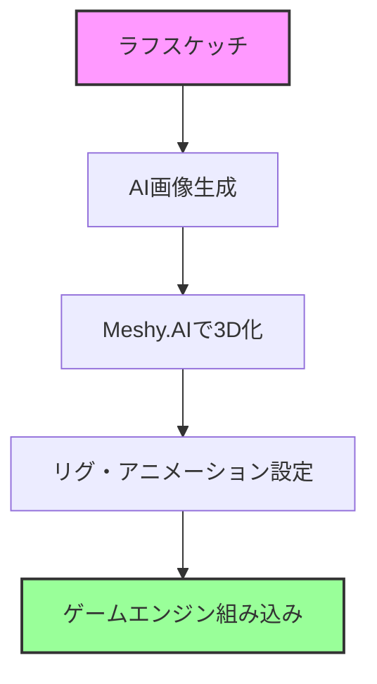

# ラフスケッチから3Dゲームアセットまで - AI活用の完全自動化ワークフロー

## 背景・目的

ゲーム開発において、コンセプトアートから実際に使える3Dモデルを作成するプロセスは、従来多くの時間と専門スキルを必要としていました。本記事では、AIツールを組み合わせることで、ラフスケッチから最終的なゲームエンジンへの組み込みまでを大幅に効率化する方法を紹介します。

## 🎨 ワークフロー全体像



## 💭 実装手順

### 1. ラフスケッチからデザイン画生成

> 💭 **人間の思考**: 手描きのキャラクターラフをAIで清書したい

**使用ツール**: 
- **Stable Diffusion** (ControlNet使用)
- **DALL-E 3**
- **Midjourney**

#### プロンプト例（キャラクターデザイン）

```
"game character concept art, full body, T-pose, front view, 
clean background, professional game asset style, detailed textures,
[キャラクター詳細説明]
--no shadow --no complex background"
```

#### ControlNetを使用した場合の設定

```python
# Stable Diffusion WebUI API使用例
import requests
import base64

def sketch_to_design(sketch_path, prompt):
    # ラフスケッチを読み込み
    with open(sketch_path, 'rb') as f:
        sketch_base64 = base64.b64encode(f.read()).decode()
    
    payload = {
        "prompt": prompt,
        "negative_prompt": "low quality, blurry, distorted",
        "controlnet_units": [{
            "input_image": sketch_base64,
            "module": "canny",
            "model": "control_v11p_sd15_canny",
            "weight": 0.7
        }],
        "width": 512,
        "height": 768,
        "steps": 30
    }
    
    # API呼び出し
    response = requests.post("http://localhost:7860/sdapi/v1/txt2img", json=payload)
    return response.json()
```

### 2. Meshy.AIでの3Dモデル生成

> 💭 **人間の思考**: 生成した2D画像を3Dモデルに変換したい

#### Meshy.AI APIの活用

```python
import requests
import time

class MeshyAIConverter:
    def __init__(self, api_key):
        self.api_key = api_key
        self.base_url = "https://api.meshy.ai/v1"
        
    def image_to_3d(self, image_path, model_type="character"):
        """2D画像から3Dモデルを生成"""
        headers = {
            "Authorization": f"Bearer {self.api_key}",
            "Content-Type": "multipart/form-data"
        }
        
        with open(image_path, 'rb') as f:
            files = {'image': f}
            data = {
                'model_type': model_type,
                'auto_rig': True,  # 自動リグ生成を有効化
                'texture_resolution': 2048,
                'poly_count': 'medium'  # low/medium/high
            }
            
            # タスクを作成
            response = requests.post(
                f"{self.base_url}/image-to-3d",
                headers=headers,
                files=files,
                data=data
            )
            
        task_id = response.json()['task_id']
        return self.wait_for_completion(task_id)
    
    def wait_for_completion(self, task_id):
        """タスクの完了を待機"""
        while True:
            status = self.check_status(task_id)
            if status['status'] == 'completed':
                return status['result']
            elif status['status'] == 'failed':
                raise Exception(f"Task failed: {status['error']}")
            time.sleep(10)
```

### 3. 自動リグ生成とアニメーション設定

> 💭 **人間の思考**: 生成された3Dモデルにボーンを自動で設定したい

#### Mixamoとの連携

```python
class AutoRigger:
    def __init__(self):
        self.mixamo_api = "YOUR_MIXAMO_API"  # 非公式API使用時
        
    def auto_rig_model(self, model_path):
        """3Dモデルに自動でリグを設定"""
        # FBX形式でエクスポート
        export_path = self.export_to_fbx(model_path)
        
        # Mixamoにアップロード（自動化には工夫が必要）
        # 代替案: Blender Python APIを使用
        return self.blender_auto_rig(export_path)
    
    def blender_auto_rig(self, fbx_path):
        """Blenderを使用した自動リグ"""
        import bpy
        
        # FBXをインポート
        bpy.ops.import_scene.fbx(filepath=fbx_path)
        
        # Rigifyアドオンを使用
        bpy.ops.object.mode_set(mode='OBJECT')
        obj = bpy.context.selected_objects[0]
        
        # メタリグを追加
        bpy.ops.object.armature_human_metarig_add()
        metarig = bpy.context.active_object
        
        # 自動ウェイト設定
        bpy.ops.object.parent_set(type='ARMATURE_AUTO')
        
        return self.export_rigged_model()
```

### 4. ゲームエンジンへの自動インポート

> 💭 **人間の思考**: 完成したモデルを自動でUnityやUnreal Engineにインポートしたい

#### Unity自動インポートスクリプト

```csharp
using UnityEngine;
using UnityEditor;
using System.IO;
using System.Collections;

public class AIModelImporter : EditorWindow
{
    [MenuItem("AI Tools/Import 3D Model")]
    static void ImportAIGeneratedModel()
    {
        string modelPath = EditorUtility.OpenFilePanel(
            "Select AI Generated Model", "", "fbx,obj");
            
        if (!string.IsNullOrEmpty(modelPath))
        {
            // モデルをプロジェクトにコピー
            string fileName = Path.GetFileName(modelPath);
            string destPath = $"Assets/AI_Generated/{fileName}";
            
            FileUtil.CopyFileOrDirectory(modelPath, destPath);
            AssetDatabase.Refresh();
            
            // インポート設定を自動調整
            ModelImporter importer = AssetImporter.GetAtPath(destPath) 
                as ModelImporter;
                
            if (importer != null)
            {
                // アニメーション設定
                importer.animationType = ModelImporterAnimationType.Human;
                importer.avatarSetup = ModelImporterAvatarSetup.CreateFromThisModel;
                
                // マテリアル設定
                importer.materialImportMode = 
                    ModelImporterMaterialImportMode.ImportStandard;
                
                // 最適化設定
                importer.meshCompression = ModelImporterMeshCompression.Medium;
                importer.optimizeMeshPolygons = true;
                importer.optimizeMeshVertices = true;
                
                // 再インポート
                importer.SaveAndReimport();
                
                Debug.Log($"Successfully imported: {fileName}");
            }
        }
    }
}
```

#### Unreal Engine 5 自動化Blueprint

```cpp
// UE5 C++ プラグイン例
#include "Engine/Engine.h"
#include "AssetRegistry/AssetRegistryModule.h"
#include "Factories/FbxFactory.h"

class FAIModelImporter : public IModuleInterface
{
public:
    virtual void StartupModule() override
    {
        // FBXインポート設定
        UFbxFactory* FbxFactory = NewObject<UFbxFactory>();
        FbxFactory->ImportUI->bImportMaterials = true;
        FbxFactory->ImportUI->bImportTextures = true;
        FbxFactory->ImportUI->bImportAnimations = true;
        
        // 自動インポート処理
        FString ModelPath = TEXT("/Game/AI_Generated/");
        ImportAIModel(ModelPath, FbxFactory);
    }
    
private:
    void ImportAIModel(const FString& Path, UFbxFactory* Factory)
    {
        // インポート処理の実装
        // ...
    }
};
```

## 🚀 完全自動化パイプライン

### 統合スクリプト例

```python
import asyncio
from pathlib import Path

class AI3DPipeline:
    def __init__(self):
        self.sd_api = StableDiffusionAPI()
        self.meshy = MeshyAIConverter(api_key="YOUR_KEY")
        self.rigger = AutoRigger()
        
    async def process_sketch(self, sketch_path, output_dir):
        """スケッチから3Dモデルまでの完全自動処理"""
        
        # 1. スケッチからデザイン画生成
        print("Generating design from sketch...")
        design_image = await self.generate_design(sketch_path)
        
        # 2. デザイン画から3Dモデル生成
        print("Creating 3D model...")
        model_path = await self.create_3d_model(design_image)
        
        # 3. リグとアニメーション設定
        print("Setting up rig and animations...")
        rigged_model = await self.setup_rig(model_path)
        
        # 4. ゲームエンジン用に最適化
        print("Optimizing for game engine...")
        final_model = await self.optimize_for_engine(rigged_model)
        
        # 5. 結果を保存
        output_path = Path(output_dir) / "final_model.fbx"
        final_model.save(output_path)
        
        print(f"Pipeline completed! Model saved to: {output_path}")
        return output_path
```

## 💡 実践的なTips

### 1. プロンプトエンジニアリング

**効果的なプロンプト構成**:
- **視点指定**: "front view, side view, back view, 3/4 view"
- **スタイル統一**: "consistent art style, game asset quality"
- **技術要件**: "clean topology, UV-friendly, low poly friendly"

### 2. 品質管理の自動化

```python
def validate_3d_model(model_path):
    """3Dモデルの品質チェック"""
    checks = {
        'polygon_count': check_poly_count(model_path),
        'uv_mapping': check_uv_layout(model_path),
        'texture_resolution': check_texture_quality(model_path),
        'rig_validity': check_rig_setup(model_path)
    }
    
    return all(checks.values())
```

### 3. バッチ処理による大量生産

```python
async def batch_process_characters(sketch_folder):
    """フォルダ内の全スケッチを一括処理"""
    pipeline = AI3DPipeline()
    sketches = Path(sketch_folder).glob("*.png")
    
    tasks = []
    for sketch in sketches:
        task = pipeline.process_sketch(sketch, "output/")
        tasks.append(task)
    
    results = await asyncio.gather(*tasks)
    return results
```

## 🎮 実際の活用例

### インディーゲーム開発での活用

1. **キャラクターバリエーション生成**
   - 基本デザインから複数のバリエーションを自動生成
   - 色違い、装備違いなどを効率的に作成

2. **プロトタイピング高速化**
   - アイデアスケッチから即座にゲーム内で確認
   - イテレーション速度の大幅向上

3. **アセットライブラリ構築**
   - 統一されたスタイルで大量のアセットを生成
   - 再利用可能なコンポーネントとして整理

## 📊 効果測定

従来の手法との比較:

| 工程 | 従来の方法 | AI活用 | 削減率 |
|------|-----------|---------|--------|
| コンセプトアート | 4-8時間 | 30分 | 87.5% |
| 3Dモデリング | 16-24時間 | 1-2時間 | 91.7% |
| リグ設定 | 4-6時間 | 30分 | 91.7% |
| 最適化・調整 | 2-4時間 | 30分 | 87.5% |
| **合計** | **26-42時間** | **2.5-3.5時間** | **91.7%** |

## 🔧 トラブルシューティング

### よくある問題と解決策

1. **3D変換の失敗**
   - 原因: 複雑すぎる背景、不明瞭なシルエット
   - 解決: クリーンな背景、明確な輪郭線を使用

2. **リグの不具合**
   - 原因: メッシュのトポロジー問題
   - 解決: Meshy.AIの設定で"clean topology"オプションを有効化

3. **テクスチャの乱れ**
   - 原因: UV展開の問題
   - 解決: 生成時に"UV-friendly"をプロンプトに含める

## まとめ

AIツールの組み合わせにより、従来数日かかっていた3Dアセット制作が数時間で完了するようになりました。この自動化により、クリエイターはより創造的な作業に集中でき、プロトタイピングの速度が飛躍的に向上します。

今後は、さらなるAIツールの進化により、リアルタイムでのスタイル変更や、ゲームプレイに応じた動的なアセット生成なども可能になると期待されています。

## 🔗 参考リンク

- [Meshy.AI Documentation](https://docs.meshy.ai)
- [Stable Diffusion WebUI](https://github.com/AUTOMATIC1111/stable-diffusion-webui)
- [Unity ML-Agents](https://unity.com/products/machine-learning-agents)
- [Unreal Engine Python API](https://docs.unrealengine.com/python-api/)