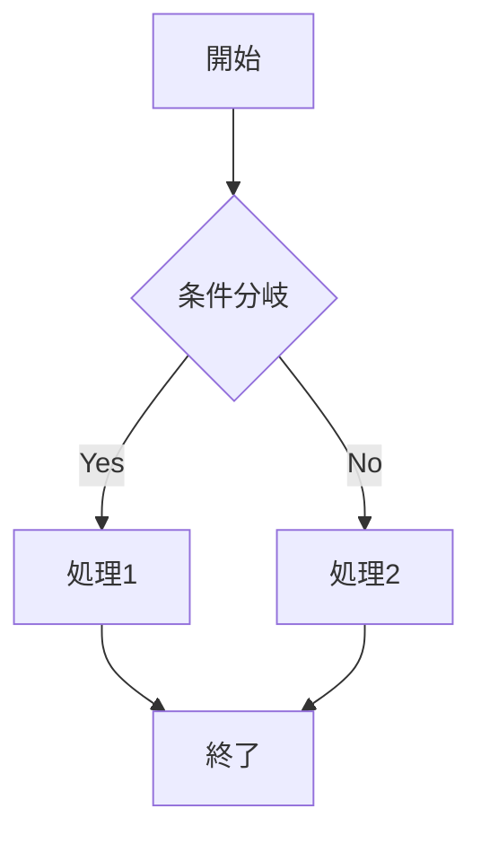
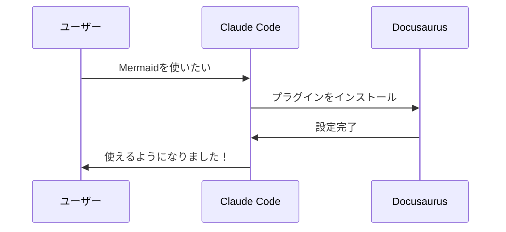
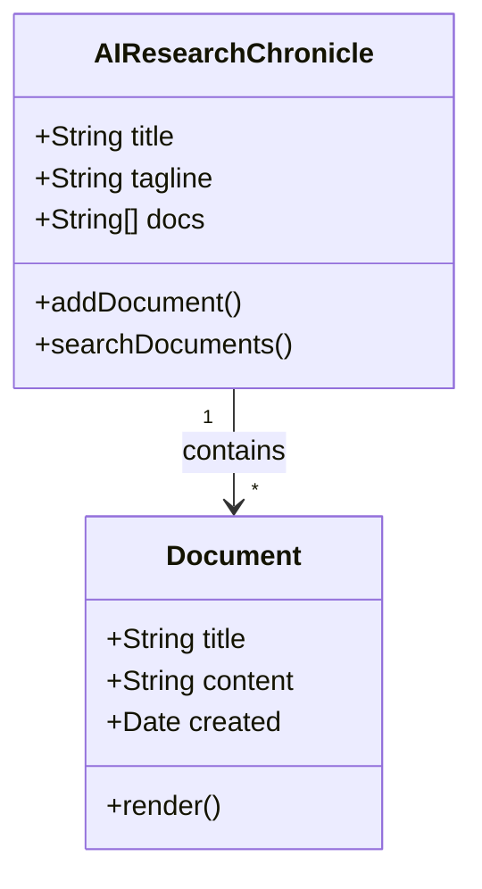
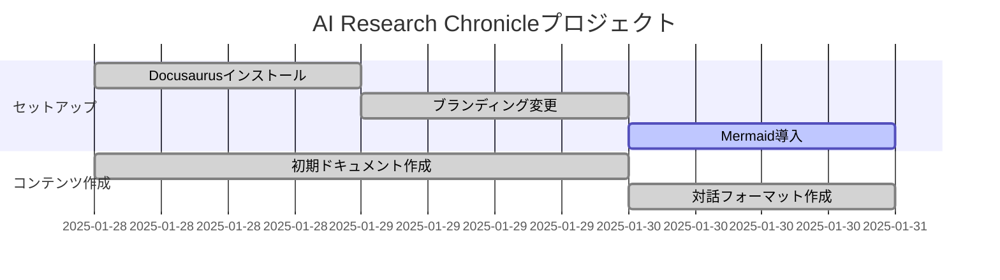
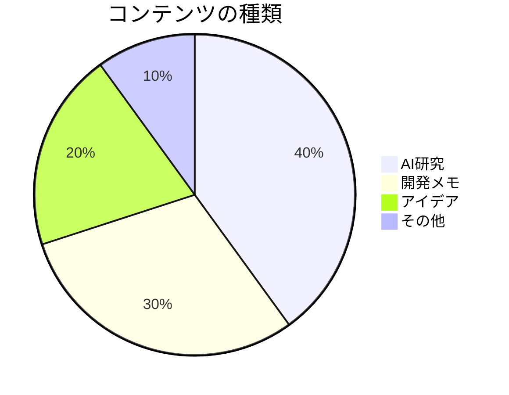
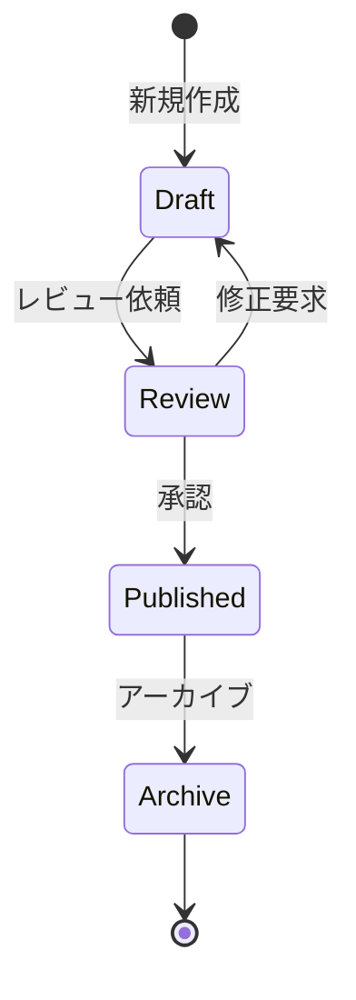

# Mermaidダイアグラムテスト

このページではMermaid記法が正しく動作するかテストします。

## フローチャート

```mermaid
flowchart TD
    A[開始] --> B{条件分岐}
    B -->|Yes| C[処理1]
    B -->|No| D[処理2]
    C --> E[終了]
    D --> E
```

## シーケンス図

```mermaid
sequenceDiagram
    participant U as ユーザー
    participant C as Claude Code
    participant D as Docusaurus
    
    U->>C: Mermaidを使いたい
    C->>D: プラグインをインストール
    D->>C: 設定完了
    C->>U: 使えるようになりました！
```

## クラス図

```mermaid
classDiagram
    class AIResearchChronicle {
        +String title
        +String tagline
        +String[] docs
        +addDocument()
        +searchDocuments()
    }
    
    class Document {
        +String title
        +String content
        +Date created
        +render()
    }
    
    AIResearchChronicle "1" --> "*" Document : contains
```

## ガントチャート

```mermaid
gantt
    title AI Research Chronicleプロジェクト
    dateFormat  YYYY-MM-DD
    section セットアップ
    Docusaurusインストール :done, setup1, 2025-01-28, 1d
    ブランディング変更 :done, setup2, after setup1, 1d
    Mermaid導入 :active, setup3, after setup2, 1d
    
    section コンテンツ作成
    初期ドキュメント作成 :done, content1, 2025-01-28, 2d
    対話フォーマット作成 :done, content2, after content1, 1d
```

## 円グラフ

```mermaid
pie title コンテンツの種類
    "AI研究" : 40
    "開発メモ" : 30
    "アイデア" : 20
    "その他" : 10
```

## 状態図

```mermaid
stateDiagram-v2
    [*] --> Draft: 新規作成
    Draft --> Review: レビュー依頼
    Review --> Published: 承認
    Review --> Draft: 修正要求
    Published --> Archive: アーカイブ
    Archive --> [*]
```

---

これらのダイアグラムが正しく表示されていれば、Mermaid記法が有効になっています！